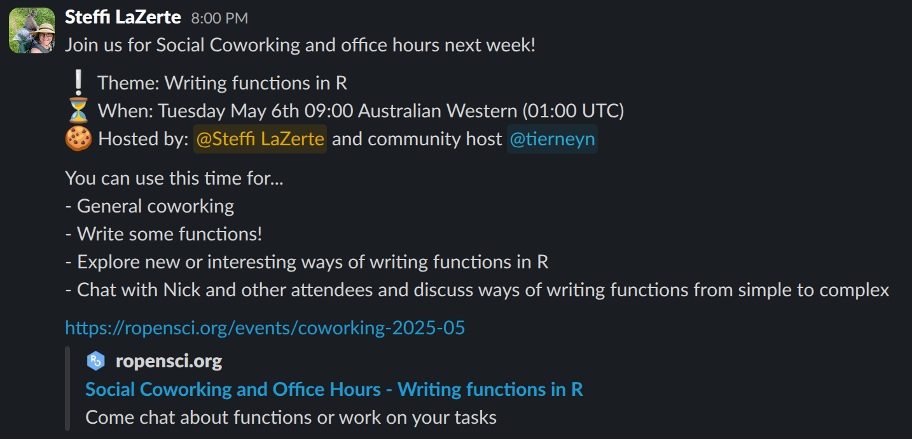

```{r, include = FALSE}
knitr::opts_chunk$set(
  collapse = TRUE,
  comment = "#>"
)
```

```{r setup}
library(promoutils)
```


Using the Slack API to schedule messages.

This assumes that we are sending messages from our *personal* user accounts. 


### Setup an App for user tokens

Following steps in Slack API Docs: https://docs.slack.dev/quickstart#creating

1. Create New (from scratch)

  - App Name: promoutils 
  - Workspace: rOpenSci

2. Create Scopes

  - Go to OAuth & Permissions, scroll down to "Scopes"
  - Add "**User** Token Scopes"
  - `channels:history`
  - `channels:read`
  - `chat:write`
  - `files:read`
  - `groups:read`
  - `groups:write`
  - `groups:history`
  - `im:write`
  - `users:read`
  
3. Install and authorize

 - Go to OAuth & Permissions > OAuth Tokens > "Install to rOpenSci" 
   (This authorizes 'promoutils' to act on *your* behalf)
 - Copy the Token and add it to your keyring in R:
   `keyring::key_set("slack-api")` (see more about [`key_set()`](https://keyring.r-lib.org/#usage)).


> Note:   
> Do not activate OAuth Token rotation because this *requires* a secure redirect 
> URL which means we can't use the http://localhost redirect URL 
> which then gets complicated.
> 
> If we leave it as token based, we don't have to rotate the token, but we DO 
> need to keep that token safe. Therefore use [keyring](https://keyring.r-lib.org/). 


### Accessing the API

Now you can access the rOpenSci Slack space using httr2 directly or via the 
promoutils helper functions.

List the currently scheduled messages:
```{r}
slack_list_scheduled()
```

Schedule a message for tomorrow (by default all messages are posted in the 
`#testing-api` channel, but you can change this with the `channel` argument.

```{r}
slack_posts_write("Testing schedules!", when = Sys.Date() + lubridate::days(1))
```

- If `when = "now"`, `slack_posts_write()` will post immediately
- If scheduled, `slack_posts_write()` will also post a copy of the message and 
it's date to scheduled in the private channel, `#admin-scheduled`, 
for quick checking of currently scheduled messages.

See the currently scheduled messages according to the Slack API
```{r}
slack_list_scheduled()
```


To delete currently scheduled messages you need to know the `channel_id` and the message `id`. 
We can get these from `slack_list_scheduled()` and supply the data frame directly.

```{r}
m <- slack_list_scheduled() |>
  dplyr::filter(text == "Testing schedules!")
m
slack_remove_scheduled(msg = m)
```

Note that `slack_remove_scheduled()` also removes the message posted to the `#admin-scheduled`
channel, so that channel *should* be a faithful representation of messages currently 
scheduled via the API.

```{r}
slack_list_scheduled()
```

