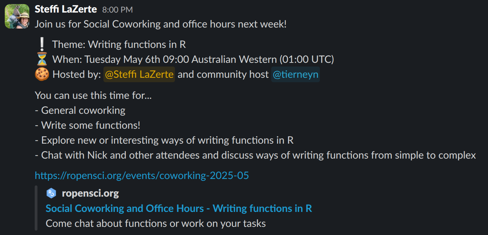

``` r
library(promoutils)
```


Using the Slack API to schedule messages.

This assumes that we are sending messages from our *personal* user accounts. 


### Setup an App for user tokens

Following steps in Slack API Docs: https://docs.slack.dev/quickstart#creating

1. Create New (from scratch)

  - App Name: promoutils 
  - Workspace: rOpenSci

2. Create Scopes

  - Go to OAuth & Permissions, scroll down to "Scopes"
  - Add "**User** Token Scopes"
  - `channels:history`
  - `channels:read`
  - `chat:write`
  - `files:read`
  - `groups:read`
  - `groups:write`
  - `groups:history`
  - `im:write`
  - `users:read`
  
3. Install and authorize

 - Go to OAuth & Permissions > OAuth Tokens > "Install to rOpenSci" 
   (This authorizes 'promoutils' to act on *your* behalf)
 - Copy the Token and add it to your keyring in R:
   `keyring::key_set("slack-api")` (see more about [`key_set()`](https://keyring.r-lib.org/#usage)).


> Note:   
>
> Do not activate OAuth Token rotation because this *requires* a secure redirect 
> URL which means we can't use the http://localhost redirect URL 
> which then gets complicated.
> 
> If we leave it as token based, we don't have to rotate the token, but we DO 
> need to keep that token safe. Therefore use [keyring](https://keyring.r-lib.org/). 


### Accessing the API

Now you can access the rOpenSci Slack space using httr2 directly or via the 
promoutils helper functions.

List the currently scheduled messages:

``` r
slack_scheduled_list()
#> Successful
#> # A tibble: 2 × 8
#>   channel    scheduled_local     text    date_created_dt     channel_id id    post_at date_created
#>   <chr>      <dttm>              <chr>   <dttm>              <chr>      <chr>   <int>        <int>
#> 1 general    2026-03-31 11:00:00 "Join … 2026-02-02 20:41:11 C026GCWKA  Q0AC…  1.77e9   1770064871
#> 2 co-working 2026-03-31 11:00:00 "Join … 2026-02-02 20:41:11 C0152F1SK… Q0AC…  1.77e9   1770064871
```

Schedule a message for tomorrow (by default all messages are posted in the 
`#testing-api` channel, but you can change this with the `channel` argument).


``` r
slack_posts_write(
  "Testing schedules in the Vignette!",
  when = Sys.Date() + lubridate::days(1)
)
#> Slack message scheduled successfully to #testing-api
#> Scheduled message successfully added to #admin-scheduled
```

- If `when = "now"`, `slack_posts_write()` will post immediately
- If scheduled, `slack_posts_write()` will also post a copy of the message and 
it's date to scheduled in the private channel, `#admin-scheduled`, 
for quick checking of currently scheduled messages.

See the currently scheduled messages according to the Slack API

``` r
slack_scheduled_list()
#> # A tibble: 3 × 8
#>   channel     scheduled_local     text   date_created_dt     channel_id id    post_at date_created
#>   <chr>       <dttm>              <chr>  <dttm>              <chr>      <chr>   <int>        <int>
#> 1 general     2026-03-31 11:00:00 "Join… 2026-02-02 20:41:11 C026GCWKA  Q0AC…  1.77e9   1770064871
#> 2 co-working  2026-03-31 11:00:00 "Join… 2026-02-02 20:41:11 C0152F1SK… Q0AC…  1.77e9   1770064871
#> 3 testing-api 2026-03-31 00:00:00 "Test… 2026-03-30 22:45:03 C08RY1PUH… Q0AP…  1.77e9   1774910703
```


To delete currently scheduled messages you need to know the `channel_id` and the message `id`. 
We can get these from `slack_list_scheduled()` and supply the data frame directly.


``` r
m <- slack_scheduled_list() |>
  dplyr::filter(text == "Testing schedules in the Vignette!")
m
#> # A tibble: 1 × 8
#>   channel     scheduled_local     text   date_created_dt     channel_id id    post_at date_created
#>   <chr>       <dttm>              <chr>  <dttm>              <chr>      <chr>   <int>        <int>
#> 1 testing-api 2026-03-31 00:00:00 Testi… 2026-03-30 22:45:03 C08RY1PUH… Q0AP…  1.77e9   1774910703
slack_scheduled_rm(msg = m)
#> Message Q0APSSHB5ML successfully removed from scheduled queue for testing-api
#> Message 1774910703.373629 successfully removed from C08T0PS0QDR
```

Note that `slack_scheduled_rm()` also removes the message posted to the `#admin-scheduled`
channel, so that channel *should* be a faithful representation of messages currently 
scheduled via the API.


``` r
slack_scheduled_list()
#> # A tibble: 2 × 8
#>   channel    scheduled_local     text    date_created_dt     channel_id id    post_at date_created
#>   <chr>      <dttm>              <chr>   <dttm>              <chr>      <chr>   <int>        <int>
#> 1 general    2026-03-31 11:00:00 "Join … 2026-02-02 20:41:11 C026GCWKA  Q0AC…  1.77e9   1770064871
#> 2 co-working 2026-03-31 11:00:00 "Join … 2026-02-02 20:41:11 C0152F1SK… Q0AC…  1.77e9   1770064871
```

However, after posts have been sent, you'll need to clean up `#admin-scheduled`


``` r
slack_cleanup()
#> Channel #admin-scheduled cleaned up
```
